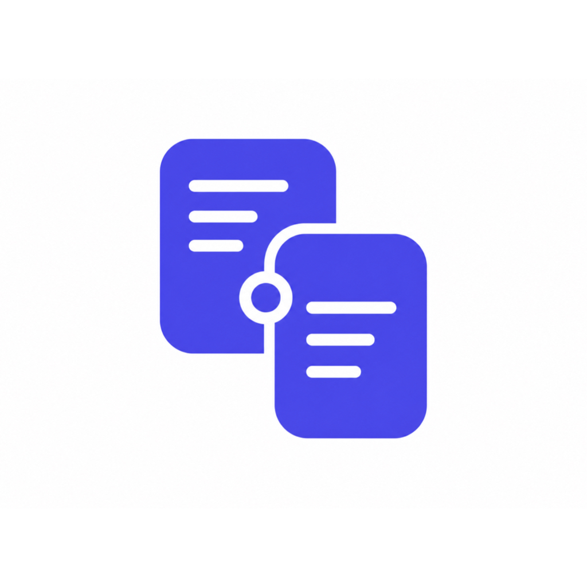
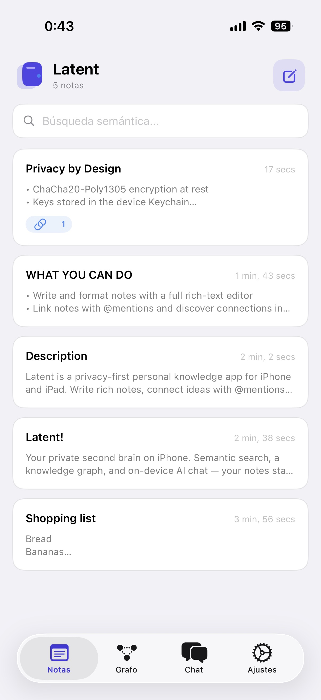
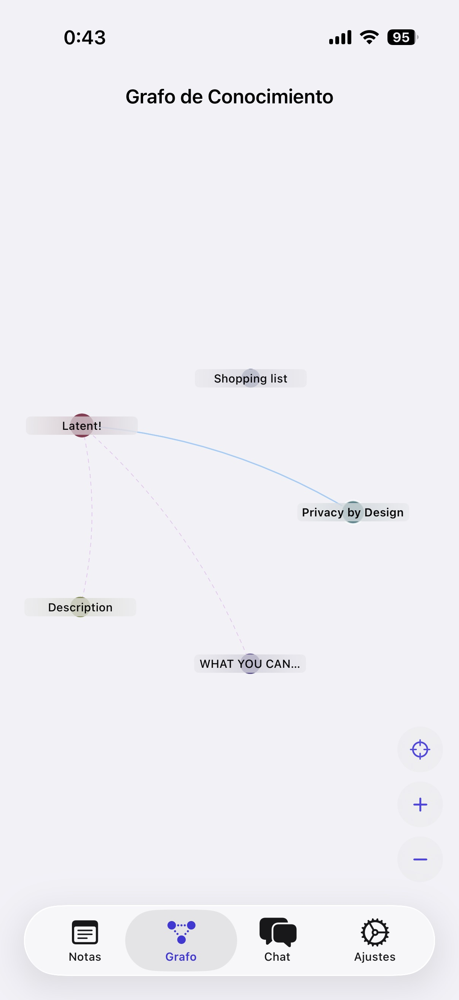
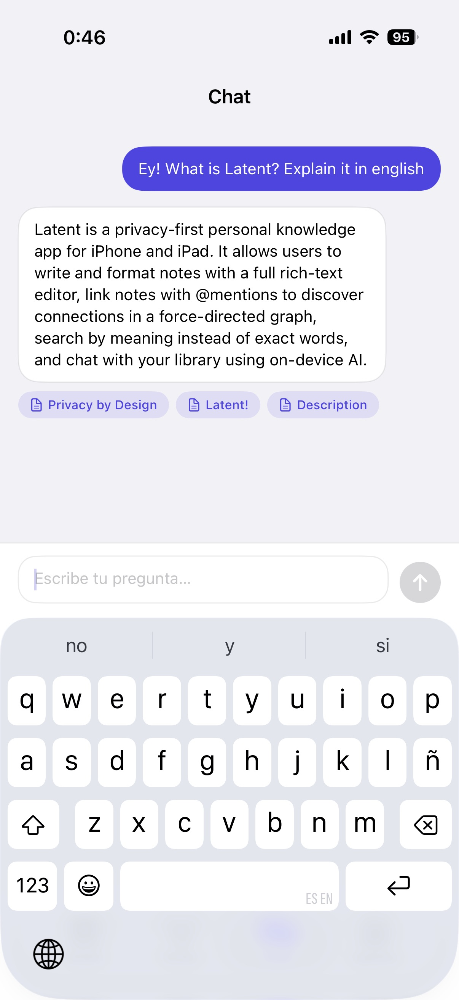

  

<h1 align="center">Latent</h1>

  <strong>Tu segundo cerebro, en el iPhone. Privado. Local. Semántico.</strong>

  <a href="#características">Características</a> ·
  <a href="#privacidad">Privacidad</a> ·
  <a href="#requisitos">Requisitos</a> ·
  <a href="#descarga">Descarga</a>

  <!-- Sustituye el enlace cuando la app esté en App Store -->
  

---

## Qué es Latent

**Latent** es una app de gestión de conocimiento personal (PKM) pensada para quien quiere **pensar, escribir y recuperar ideas** sin depender de la nube para la inteligencia artificial.

Escribes notas con un editor completo, las conectas con menciones `@`, exploras cómo se relacionan en un **grafo de conocimiento** y les preguntas en lenguaje natural: la app recupera el contexto relevante y **Apple Intelligence** responde **en tu dispositivo**.

Sin servidores de IA. Sin enviar tus notas a terceros para generar respuestas.

---

## Características

### Notas que se entienden entre sí
Editor rich text con formato persistente, menciones `@` entre notas y vista previa limpia. Organiza por enlaces y significado, no por carpetas rígidas.

### Búsqueda semántica
Encuentra ideas por intención, no solo por palabras exactas. Un modelo de embeddings multilingüe corre en el **Neural Engine** del iPhone.

### Grafo de conocimiento
Visualiza enlaces explícitos entre notas y conexiones descubiertas por similitud semántica. Un mapa vivo de tu pensamiento.

### Chat con tu biblioteca
Pregunta sobre lo que has escrito. Latent combina recuperación híbrida (léxica + vectorial) con generación on-device vía **Apple Intelligence**, con citas a las notas fuente.

### Privacidad por diseño
- Cifrado **ChaCha20-Poly1305** en reposo  
- Claves en el **Keychain** del dispositivo  
- Sincronización opcional de notas con **tu iCloud privado** (el chat no se sincroniza)  
- Importación de PDFs para ampliar tu base de conocimiento  

### Hecha para el sistema
- Tema claro, oscuro o automático  
- Interfaz en **19 idiomas** (sigue el idioma del iPhone)  
- Diseño nativo con SwiftUI  

---

## Privacidad

Latent está construida con un principio simple: **tu conocimiento es tuyo**.

| Qué | Dónde ocurre |
|-----|----------------|
| Embeddings y búsqueda | En el iPhone |
| Generación de respuestas del chat | Apple Intelligence, on-device |
| Notas (opcional) | Tu contenedor iCloud privado, cifrado en el dispositivo antes de guardar |
| Tracking o analítica de contenido | No |

No vendemos datos. No entrenamos modelos con tus notas.

---

## Requisitos

- **iOS 26** o posterior  
- **Apple Intelligence** activo en un dispositivo compatible  
- Chip **A17 Pro** o superior (p. ej. iPhone 15 Pro en adelante), según disponibilidad regional de Apple Intelligence  

> Latent comprueba en tiempo de ejecución que Apple Intelligence esté disponible. Si no lo está, la app muestra cómo activarlo o qué dispositivos son compatibles.

---

## Capturas

  
  
  

---

## Descarga

Disponible en el **App Store** para iPhone y iPad.

<!-- Actualiza el ID cuando publiques -->
**[Descargar Latent en el App Store](https://apps.apple.com/app/latent/6786011834)**

---

## Sobre este repositorio

Este repositorio es un **escaparate del producto**. El código fuente de Latent no es público: aquí encontrarás documentación de producto, recursos de marca y novedades de versiones.

Si te interesa el trabajo detrás de la app — arquitectura RAG on-device, integración con Foundation Models, PKM local-first — puedes seguir el proyecto o contactar al autor.

---

## Autor

**Juan Martos**  
[GitHub](https://github.com/juanmmm21) · [App Store](https://apps.apple.com/app/latent/6786011834)

---

  Latent © Juan Martos. Apple, iPhone, iCloud, Apple Intelligence y App Store son marcas de Apple Inc.

